## The Gcloud assignment

Make a new `webserver` repo on your github user, then

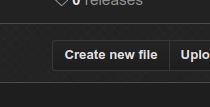

Make an index.html

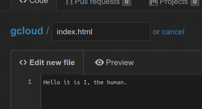

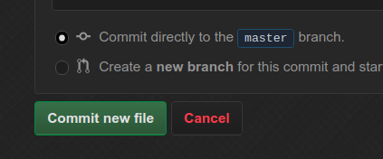

For Dockerfile:

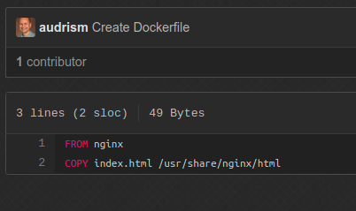

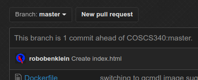

Got Dockerfile and index?

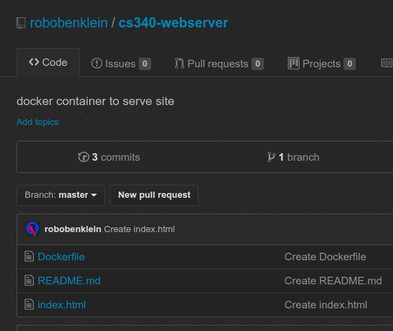

Ok ready for next part

#### > create dockerhub account [hub.docker.com](http://hub.docker.com)

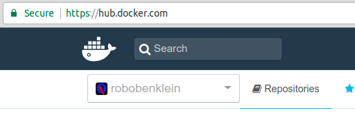

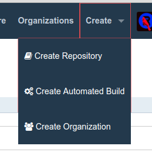

`Create automated build`

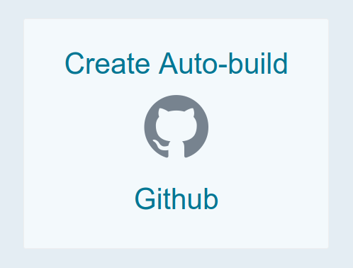

Select the repo

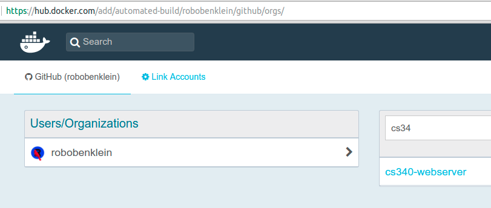


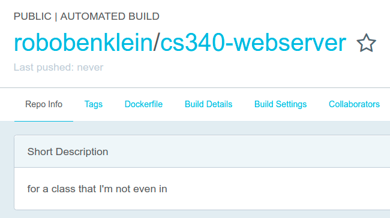

Go to "Build Settings" and hit the trigger button for master:

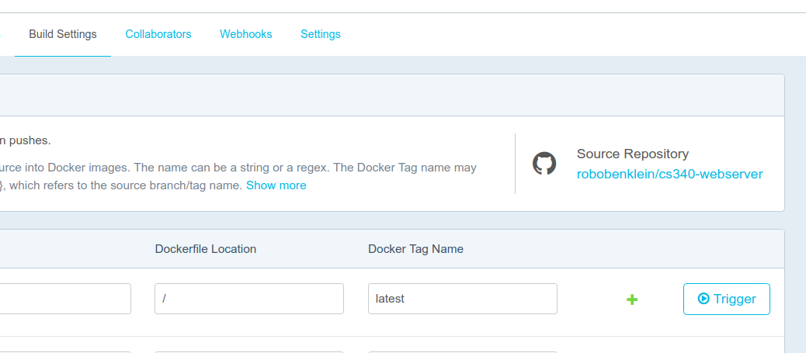

Done with the docker stuff for now.

# Now to Google Cloud

Get dat URL from the lectures repo.

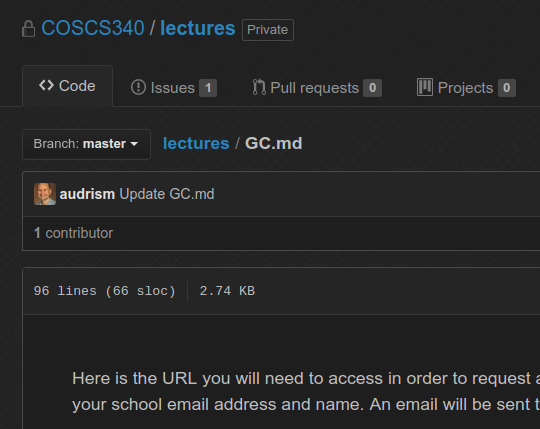

Set up yer account

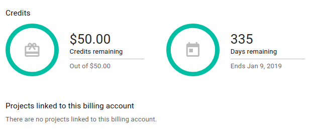

Make a new cs340 project if you don't have one yet:


Select the cs340 project

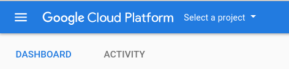


Click on the compute engine to set it up for the project:

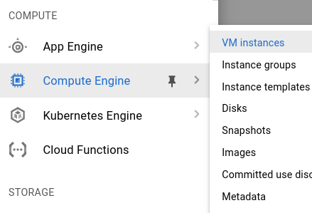

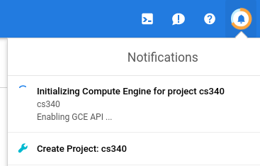

Hmm this seems to be taking awhile...

Ok done.

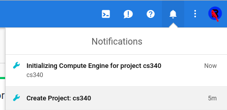

Click on the VM instances or the link below

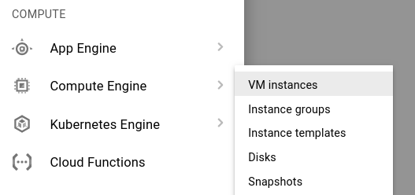

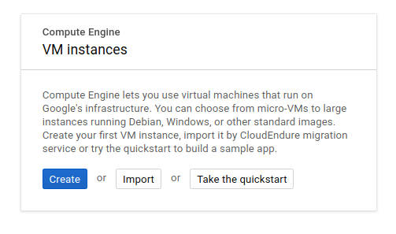

or go to [https://console.cloud.google.com/compute/instances](https://console.cloud.google.com/compute/instances) to create a VM instance if you don't see that button

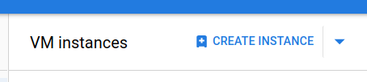

"Create"

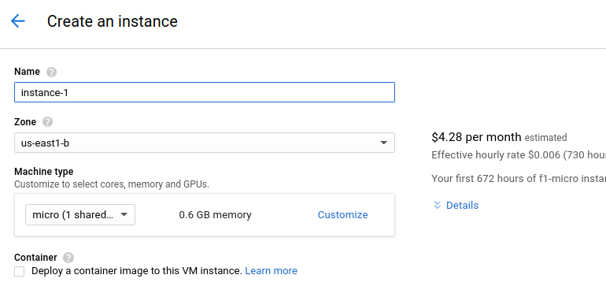

Check the "Deploy a container image" so that we can use our docker container.

Remember this?

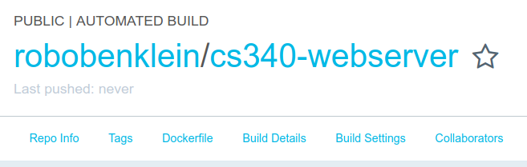

Put that title into this:

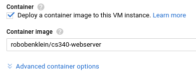

Add HTTP for the firewall:

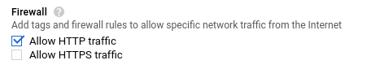

Click that more config stuff dropdown:

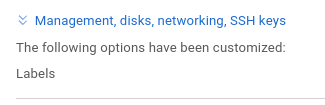

Now add this into the boot script: (modify it first)

```
#!/bin/bash
docker rm ws
docker run -d --name ws -p80:80 YOURGITHUBUSER/webserver
```

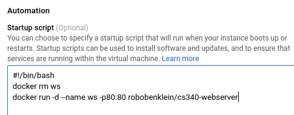

Done here.


Being created:

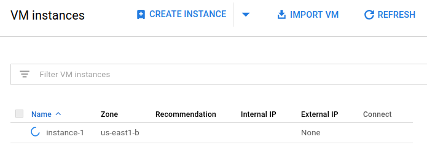

Done:

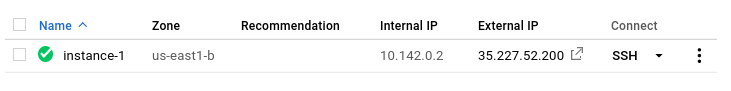

Click on that IP: WEBSITE!

E.x. [http://35.196.184.168/](http://35.196.184.168/)

Now remember to add your IP for your site to the *LAST LINE* of your markdown file in https://github.com/COSCS340/students !
